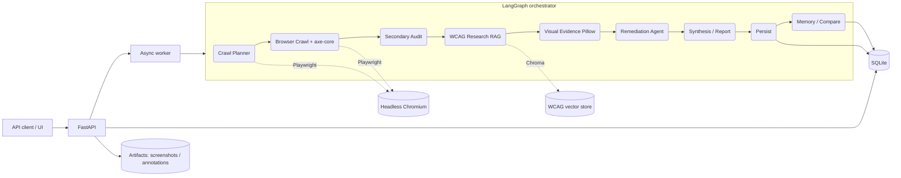

# Accessibility Remediation Copilot

A course-ready, multi-agent **GenAI** application that crawls a website,
detects accessibility violations, highlights issue regions on screenshots,
retrieves grounded **WCAG** guidance via RAG, and produces developer-ready
remediation code — all via a clean REST API so you can plug in any
frontend (a Vercel demo UI is included).

> **Product framing:** Accessibility Remediation Copilot for E-commerce and
> SMB Websites. Small businesses and e-commerce teams struggle to find and
> fix accessibility issues. Manual audits are expensive and slow. This
> system combines **browser automation + WCAG RAG + LLM reasoning** to
> deliver prioritized, grounded, code-level remediation in minutes.

---

## Table of contents

1. [Business problem & why GenAI](#business-problem--why-genai)
2. [Architecture](#architecture)
3. [Agents](#agents)
4. [RAG design](#rag-design)
5. [Memory / persistence](#memory--persistence)
6. [Scoring model](#scoring-model)
7. [REST API](#rest-api)
8. [Local setup](#local-setup)
9. [Running scans](#running-scans)
10. [Demo script](#demo-script)
11. [Evaluation](#evaluation)
12. [Environment variables](#environment-variables)
13. [Repository layout](#repository-layout)
14. [Deploying the Vercel frontend](#deploying-the-vercel-frontend)
15. [Responsible AI & limitations](#responsible-ai--limitations)

---

## Business problem & why GenAI

- Accessibility audits are **slow, expensive, and inconsistent**.
- Scanners (axe, WAVE, Pa11y) give *findings* but not **fixes**.
- Teams need to know **which issues matter most** and **how to fix them**
  for their exact markup.
- A GenAI system can turn a pile of violations into an **actionable, grounded,
  code-level plan** by combining:
  - real browser automation (renders JS, real DOM state)
  - axe-core + an independent HTML validator
  - RAG over official W3C WCAG material so guidance is grounded, not invented
  - screenshot annotation so humans can see the exact defect
  - persistent scan memory so teams can track progress over time

---

## Architecture



**Request lifecycle**

1. `POST /api/scans` creates a row and schedules a background task.
2. The LangGraph flow runs: plan → crawl → axe → secondary → RAG → annotate →
   remediate → synthesize → persist → compare-with-history.
3. `GET /api/scans/{id}` returns status / score; `GET …/findings` returns the
   full grouped report.

**Decoupling:** the backend serves a minimal demo UI at `/ui/`, but the
**API is the product**. You can point any frontend at it (e.g. a Vercel
deployment — see [Deploying the Vercel frontend](#deploying-the-vercel-frontend)).

---

## Agents

Each agent is a **LangGraph node** with a focused prompt (or deterministic
logic when the LLM is disabled).

| # | Agent | Responsibility | Prompt? |
|---|---|---|---|
| 1 | **Crawl Planner** (`app/agents/crawl_planner.py`) | Pick prioritized on-domain URLs to scan. | Yes |
| 2 | **Browser Crawl + Accessibility Scan** (`browser_crawl.py`) | Playwright renders each URL, screenshots, injects axe-core, harmonises findings. | No (deterministic) |
| 3 | **Secondary Audit** (`secondary_auditor.py` / `services/secondary_audit.py`) | Independent HTML validator → cross-checks axe → sets `confidence`. | No |
| 4 | **WCAG Research** (`wcag_research.py`) | RAG over the W3C WCAG corpus, attaches grounded evidence. | No (but RAG-powered) |
| 5 | **Visual Evidence** (`visual_evidence.py` / `services/annotation.py`) | Resolves each selector in Playwright, draws a colored bounding box with Pillow. | No |
| 6 | **Remediation** (`remediation.py`) | Produces explanation, why-it-matters, fix, code snippet — **grounded in retrieved WCAG evidence**. | Yes (with deterministic fallback) |
| 7 | **Synthesis / Reporting** (`synthesis.py`) | Executive summary, top priorities, business-value statement. | Yes (with template fallback) |
| 8 | **Memory** (`memory.py`) | Diffs against the most recent scan for the same domain; persists compare summaries. | No |

### Prompt engineering

- Every prompt lives in `app/agents/prompts.py`.
- Prompts are **small, single-purpose, JSON-shaped** (`response_format=json_object`).
- The Remediation prompt explicitly says: *"You MUST prefer retrieved
  evidence over your memory; never fabricate WCAG URLs."*
- When evidence is empty, the model is required to emit `"grounded": false`
  — this propagates into the UI and the report.

### Graceful degradation

- **No API key?** The system runs end-to-end using deterministic
  rule-based remediation + retrieval grounding. Nothing is faked.
- **Page fails to load?** That page is marked `error`; the rest of the
  scan continues.
- **Selector not resolvable?** The finding stays un-annotated but is still
  reported with its WCAG reference and remediation.

---

## RAG design

- **Corpus:** paraphrased summaries + canonical W3C URLs for the most common
  success criteria (see `backend/data/wcag_corpus/`). Sources listed in
  `backend/data/wcag_corpus/SOURCES.md` — all from W3C / WAI.
- **Chunking:** Markdown-H2 split with a character-windowed fallback
  (`backend/app/rag/ingest.py`).
- **Embeddings:**
  - `local` — `sentence-transformers/all-MiniLM-L6-v2` (default, no key
    required),
  - `openai` — `text-embedding-3-small`,
  - ultimate fallback — a deterministic hashing embedding so ingestion /
    retrieval are never blocked.
- **Vector store:** **Chroma** (persistent), with a flat JSON fallback if
  Chroma isn't available.
- **Retriever:** cosine similarity, top-K, returns `{criterion, level, url,
  snippet, score}`.
- **Grounding check:** every finding gets a `grounded` boolean. If the
  index is empty, remediations are explicitly flagged as un-grounded so
  reviewers know to double-check.

Rebuild the index:

```bash
python scripts/ingest_wcag.py
```

---

## Memory / persistence

- **SQLite** (via SQLAlchemy async engine).
- Tables: `scans`, `pages`, `findings`, `scan_comparisons`.
- Each `Finding` stores its WCAG references, remediation JSON, bounding box,
  annotated-screenshot path, source (`axe` / `secondary`), and confidence.
- The **Memory Agent** computes a (rule_id, selector) fingerprint for every
  finding and diffs against the previous scan of the same domain:
  - `new_issues` — present now, not before
  - `resolved_issues` — present before, gone now
  - `recurring_issues` — present in both
- `GET /api/scans/{id}/compare/{prev_id}` recomputes on demand.

---

## Scoring model

Transparent and deterministic (`backend/app/services/scoring.py`):

```
base = 100
penalty_per_finding = weight[severity] * page_importance_mult * systemic_mult
weight = {critical: 10, serious: 5, moderate: 2, minor: 1}
page_importance_mult = 1.5 if page.priority >= 90 (homepage) else 1.0
systemic_mult = 1.25 → 2.0 if a rule appears on >50% of pages
score = clamp(0..100, 100 - sum(penalty))
grade = A(90+) | B(80+) | C(70+) | D(60+) | F(<60)
```

`stats_json` on each scan exposes severity breakdown, top rules, systemic
rules, and grounded-percentage — enough to explain *why* a score was given.

---

## REST API

Full schema is published by FastAPI at **`/docs`**. Summary:

| Method | Path | Purpose |
|---|---|---|
| GET | `/api/health` | Liveness |
| GET | `/api/config` | Safe public config (never secrets) |
| POST | `/api/scans` | Start a scan |
| GET | `/api/scans` | List recent scans (optional `?domain=`) |
| GET | `/api/scans/{id}` | Scan status + summary + pages |
| GET | `/api/scans/{id}/findings` | Full findings grouped by page |
| GET | `/api/scans/{id}/history` | Prior scans for the domain |
| GET | `/api/scans/{id}/compare/{prev_id}` | Diff two scans |
| GET | `/api/scans/{id}/artifacts` | Paths to screenshots + annotations |
| GET | `/api/wcag/search?q=…` | Search the grounded WCAG corpus |

All responses are Pydantic-typed (see `app/models/schemas.py`).

### Example calls

```bash
# Start a scan
curl -sX POST http://localhost:8000/api/scans \
  -H "content-type: application/json" \
  -d '{"root_url":"https://example.com","crawl_depth":1,"page_limit":3}'

# Poll
curl -s http://localhost:8000/api/scans/<id>

# Get findings
curl -s http://localhost:8000/api/scans/<id>/findings | jq .

# Compare with a previous scan
curl -s http://localhost:8000/api/scans/<id>/compare/<prev_id> | jq .

# Search the WCAG corpus directly
curl -s 'http://localhost:8000/api/wcag/search?q=alt+text+image'
```

---

## Local setup

Requirements: Python 3.11+, ~2 GB free disk (first-time model download).

```bash
git clone <this repo>
cd CCWCAG

# create venv
python -m venv .venv && source .venv/bin/activate

# deps
pip install -r backend/requirements.txt

# one-time: install the Chromium browser for Playwright
python -m playwright install chromium

# config
cp .env.example .env          # edit to add OPENAI_API_KEY if you have one

# build the WCAG vector store
python scripts/ingest_wcag.py

# run the server
uvicorn backend.app.main:app --reload --host 0.0.0.0 --port 8000

# open the demo UI
open http://localhost:8000/ui/
```

**Running without an API key:** the system is fully functional. Remediation
uses deterministic rule-based templates grounded in retrieved WCAG
evidence; synthesis uses a templated executive summary. The `/api/config`
endpoint and the UI header will show `LLM off (deterministic fallback)`.

---

## Running scans

From the demo UI:
1. Open `/ui/`.
2. Enter a URL, choose depth & page limit, click **Start scan**.
3. Watch the progress stepper (planning → rendering → axe → WCAG → …).
4. Inspect grouped findings with annotated screenshots, snippets, and WCAG
   citations.
5. Prior scans of the same domain appear in the **Scan history** card —
   click **Compare** for a diff.

From the API: see examples above.

---

## Demo script

1. **Run the bad demo page:**
   `POST /api/scans { root_url: "https://www.w3.org/WAI/demos/bad/before/home.html", page_limit: 3 }`
   → expect dozens of findings, score in the low range.
2. **Run the good demo page:**
   `POST /api/scans { root_url: "https://www.w3.org/WAI/demos/bad/after/home.html", page_limit: 3 }`
   → expect few findings, score ≥ 85.
3. **Show the compare view** between the two bad-page scans to demonstrate
   memory / history.
4. **Inspect artifacts:** `GET /api/scans/{id}/artifacts` returns
   screenshot + annotation paths that can be opened in the browser.

---

## Evaluation

A lightweight harness is provided at `scripts/run_eval.py`. It:

- scans a known-good and a known-bad demo page,
- reports pages scanned, findings count, severity breakdown, and the
  percentage of findings that carry screenshot / WCAG evidence,
- exercises the compare endpoint with a repeat scan,
- writes the JSON report to `backend/data/artifacts/reports/eval_<ts>.json`.

Example (with the server running):

```bash
python scripts/run_eval.py --base http://localhost:8000
```

A sample artifact lives at
`backend/data/artifacts/reports/sample_eval.json` for reference.

---

## Environment variables

See [`.env.example`](./.env.example) for the full list. Highlights:

| Var | Default | Notes |
|---|---|---|
| `MODEL_PROVIDER` | `openai` | Any OpenAI-compatible provider |
| `MODEL_NAME` | `gpt-4o-mini` | Override per your account |
| `OPENAI_API_KEY` | *(empty)* | **Leave blank to run without LLM.** Never commit. |
| `EMBEDDINGS_PROVIDER` | `local` | `local` (sentence-transformers) or `openai` |
| `PLAYWRIGHT_HEADLESS` | `true` | Set `false` to watch the browser locally |
| `SQLITE_PATH` | `./backend/data/app.db` | |
| `VECTOR_DB_PATH` | `./backend/data/vectorstore` | |
| `ARTIFACTS_DIR` | `./backend/data/artifacts` | screenshots, annotations, reports |

---

## Repository layout

```
/backend
  /app
    /agents        LangGraph nodes (one per agent)
    /api           FastAPI routers (scans, meta)
    /core          config, logging
    /db            SQLAlchemy engine + repository helpers
    /models        ORM + Pydantic schemas
    /rag           embeddings, ingest, retriever
    /services      browser, secondary_audit, annotation, llm, scoring
    /utils         url, path helpers
    /workers       async scan runner
    main.py        FastAPI app factory
  /data
    /wcag_corpus   W3C-sourced markdown grounding material
    /artifacts     screenshots, annotations, reports
  /static          minimal demo UI (HTML/CSS/JS, no framework)
  /tests           pytest suite (pure-logic + RAG smoke)
/frontend          Vercel-deployable static frontend mirror
/scripts           ingest_wcag.py, run_eval.py
/docs              (extra docs + architecture notes)
README.md
.env.example
```

---

## Deploying the Vercel frontend

Vercel can't run our backend (Playwright needs a long-running Chromium and a
full filesystem — neither fit the serverless model). We instead deploy the
static demo UI to Vercel and point it at whatever host runs your FastAPI
backend.

1. Deploy `/frontend` to Vercel (see [`/frontend/README.md`](./frontend/README.md)).
2. Host the backend somewhere that supports Playwright (Fly.io, Render,
   Railway, a VM, Docker). The backend exposes permissive CORS by default.
3. Open the Vercel URL with `?api=https://your-backend.example.com` the
   first time — it's cached in `localStorage`.

---

## Responsible AI & limitations

- Automated accessibility tools catch roughly **30–50%** of WCAG issues.
  **They do not guarantee legal compliance.**
- LLM-generated remediations are **suggestions** and must be reviewed by a
  qualified developer before shipping.
- Screenshots are captured client-side by the tool; make sure you have the
  right to scan the target site.
- RAG grounding reduces but does **not** eliminate hallucinations. When
  `grounded=false`, the UI flags the finding for human review.
- The scoring model is transparent and deterministic — it's a priority
  ranker, not a compliance certification.
- Keep your API keys out of source control and client-side code. The
  `/api/config` endpoint never returns secrets.